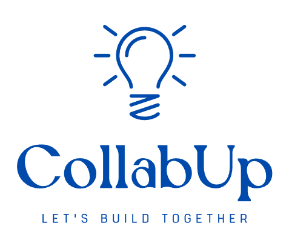

# CollabUp - Collaborative Learning Platform

<div align="center">
  
  
  **A comprehensive platform connecting students, mentors, and startups for collaborative projects and opportunities**
  
  [](https://developer.android.com/)
  [](https://kotlinlang.org/)
  [](https://firebase.google.com/)
  [](LICENSE)
</div>

## 📱 Overview

CollabUp is an Android application designed to bridge the gap between students, mentors, and startups. It provides a comprehensive platform for discovering opportunities, connecting with like-minded individuals, and participating in collaborative projects.

### ✨ Key Features

- **🔍 Intelligent Search**: AI-powered search across students, mentors, projects, and opportunities
- **👥 Community Building**: Connect with students and mentors in your area
- **📋 Project Management**: Create, discover, and collaborate on projects
- **🎓 Mentorship**: Find mentors and book sessions for guidance
- **🏆 Opportunities**: Discover hackathons, internships, and research opportunities
- **🤖 AI Assistant**: Built-in chatbot for guidance and support
- **📧 Email Integration**: Seamless communication between users

## 🏗️ Architecture

### Tech Stack

- **Language**: Kotlin
- **Platform**: Android (API 26+)
- **Backend**: Firebase (Firestore, Authentication, Storage)
- **UI Framework**: Material Design 3
- **Image Loading**: Glide
- **Async Operations**: Kotlin Coroutines
- **Navigation**: Android Navigation Component
- **Animations**: Lottie

### Project Structure

```
app/src/main/java/com/princemaurya/collabup000/
├── activities/           # Main application activities
├── adapters/            # RecyclerView and ViewPager adapters
├── data/                # Sample data and models
├── fragments/           # Main UI fragments
├── models/              # Data models and classes
├── services/            # Business logic and API services
└── utils/               # Utility classes and helpers
```

## 🚀 Getting Started

### Prerequisites

- Android Studio Arctic Fox or later
- Android SDK API 26+
- Firebase project

### Installation

1. **Clone the repository**
   ```bash
   git clone https://github.com/yourusername/CollabUp.git
   cd CollabUp
   ```

2. **Set up Firebase**
   - Create a new Firebase project at [Firebase Console](https://console.firebase.google.com/)
   - Enable Authentication, Firestore, and Storage
   - Download `google-services.json` and place it in the `app/` directory

3. **Configure Google Cloud**
   - Follow the [Google Drive Setup Guide](GOOGLE_DRIVE_SETUP.md)
   - Enable Google Sign-In API
   - Configure OAuth 2.0 credentials

4. **Build and Run**
   ```bash
   ./gradlew assembleDebug
   ```

## 🎯 Features in Detail

### 🏠 Home Fragment
- **Personal Projects Dashboard**: View and manage your created projects
- **Banner Carousel**: Featured opportunities and announcements
- **Quick Actions**: Add new projects, search functionality
- **Auto-scrolling Updates**: Dynamic content rotation

### 👥 Community Fragment
- **Top Achievements**: Showcase student and mentor accomplishments
- **Top Students**: Discover high-performing students
- **Area-based Connections**: Find people near you
- **Intelligent Search**: AI-powered student discovery

### 🎓 Mentors Fragment
- **Expert Achievements**: Highlight mentor accomplishments
- **Top Rated Mentors**: Browse highly-rated mentors
- **Session Booking**: Schedule mentorship sessions
- **Expertise-based Search**: Find mentors by skills and domain

### 💼 Opportunities Fragment
- **Featured Opportunities**: Curated hackathons and programs
- **Project Discovery**: Browse collaborative projects
- **Hackathon Listings**: Find upcoming competitions
- **Intelligent Matching**: AI-recommended opportunities

### 📋 Projects Fragment
- **Project Creation**: Build new collaborative projects
- **Project Discovery**: Find projects to join
- **Category Filtering**: Browse by domain and technology
- **Detailed Project Views**: Comprehensive project information

### 👤 Profile Fragment
- **User Profile Management**: Edit personal information
- **Skills & Interests**: Manage expertise areas
- **Connection History**: View past interactions
- **Settings & Preferences**: Customize app experience

## ⚙️ Configuration

### Firebase Setup

1. **Authentication**
   - Enable Email/Password authentication
   - Enable Google Sign-In
   - Configure OAuth consent screen

2. **Firestore Rules**
   ```javascript
   rules_version = '2';
   service cloud.firestore {
     match /databases/{database}/documents {
       // Add your security rules here
     }
   }
   ```

3. **Storage Rules**
   ```javascript
   rules_version = '2';
   service firebase.storage {
     match /b/{bucket}/o {
       // Add your storage rules here
     }
   }
   ```

### Google Drive Integration

The app includes Google Drive integration for profile image uploads. See [GOOGLE_DRIVE_SETUP.md](GOOGLE_DRIVE_SETUP.md) for detailed setup instructions.

## 🎨 UI/UX Features

### Design System
- **Material Design 3**: Modern, accessible design language
- **Custom Gradients**: Beautiful card backgrounds
- **Smooth Animations**: Lottie animations and transitions
- **Responsive Layout**: Adapts to different screen sizes

### Navigation
- **Bottom Navigation**: Easy access to main sections
- **Floating Action Button**: Quick access to chatbot
- **Profile Menu**: Overlay menu with user options

### Interactive Elements
- **Search Bars**: Real-time search with debouncing
- **Carousel Views**: Swipeable content cards
- **Horizontal Lists**: Scrollable item collections
- **Loading States**: User feedback during operations

## 🔍 Search & Discovery

### Intelligent Search
- **Multi-field Search**: Search across names, skills, descriptions
- **AI Recommendations**: Smart content suggestions
- **Real-time Results**: Instant search feedback
- **Filter Options**: Refine search results

### Recommendation Engine
- **Skill-based Matching**: Connect users with similar interests
- **Location-based Suggestions**: Find people in your area
- **Project Recommendations**: Suggest relevant projects
- **Opportunity Matching**: Personalized opportunity suggestions

## 📧 Communication

### Email Integration
- **Connection Requests**: Send connection emails to students
- **Session Bookings**: Email mentors for sessions
- **Project Invitations**: Invite collaborators via email
- **Feedback System**: Send app feedback to developers

### Chatbot Assistant
- **24/7 Support**: Always available AI assistant
- **Context-aware Responses**: Intelligent conversation flow
- **Quick Actions**: Direct access to app features
- **Help & Guidance**: User onboarding and support

## 🛠️ Development

### Code Quality
- **Kotlin Best Practices**: Modern Android development
- **MVVM Architecture**: Clean separation of concerns
- **Repository Pattern**: Centralized data management
- **Error Handling**: Comprehensive exception management

### Testing
- **Unit Tests**: Core functionality testing
- **UI Tests**: User interface validation
- **Integration Tests**: Firebase integration testing

### Performance
- **Image Optimization**: Efficient image loading with Glide
- **Lazy Loading**: On-demand content loading
- **Caching**: Smart data caching strategies
- **Memory Management**: Efficient resource utilization

## 📊 Data Models

### User Types
- **Students**: Academic background, skills, interests
- **Mentors**: Expertise, experience, availability
- **Startups**: Company info, project requirements
- **Faculty**: Academic credentials, research areas

### Content Types
- **Projects**: Collaborative work opportunities
- **Hackathons**: Competitive programming events
- **Internships**: Professional development opportunities
- **Research**: Academic collaboration projects

## 🔐 Security

### Authentication
- **Firebase Auth**: Secure user authentication
- **Google Sign-In**: OAuth 2.0 integration
- **Session Management**: Secure session handling
- **Permission Control**: Role-based access control

### Data Protection
- **Encrypted Storage**: Secure data storage
- **Privacy Controls**: User privacy settings
- **Data Validation**: Input sanitization
- **Secure Communication**: HTTPS API calls

## 🚀 Deployment

### Release Process
1. **Version Management**: Semantic versioning
2. **Build Configuration**: Release build setup
3. **Code Signing**: APK signing and verification
4. **Distribution**: Google Play Store deployment

### Monitoring
- **Crash Reporting**: Firebase Crashlytics
- **Analytics**: User behavior tracking
- **Performance Monitoring**: App performance metrics
- **Error Tracking**: Comprehensive error logging

## 🤝 Contributing

We welcome contributions! Please see our [Contributing Guidelines](CONTRIBUTING.md) for details.

### Development Setup
1. Fork the repository
2. Create a feature branch
3. Make your changes
4. Add tests
5. Submit a pull request

### Code Style
- Follow Kotlin coding conventions
- Use meaningful variable names
- Add comments for complex logic
- Maintain consistent formatting

## 📦 Download APK

[⬇️ Click here to download the latest APK](https://drive.google.com/file/d/1GqlPC04rYMIvm0cEGGehJdKpVbC0P3ek/view?usp=sharing)


## 📄 License

This project is licensed under the MIT License - see the [LICENSE](LICENSE) file for details.

## 🙏 Acknowledgments

- **Firebase Team**: For the excellent backend services
- **Material Design Team**: For the beautiful design system
- **Open Source Community**: For the amazing libraries and tools
- **Beta Testers**: For valuable feedback and suggestions

## 📞 Support

- **Email**: collabup4@gmail.com
